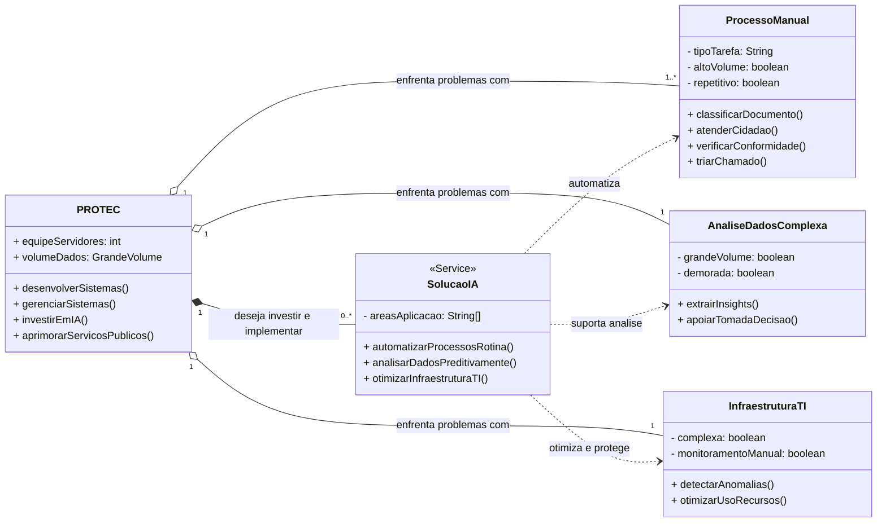

As your thought partner, I can help you quickly analyze complex information from the provided sources to develop strategic recommendations for senior leadership. I will break down information, clarify terminology, and guide you through the material to help you make well-reasoned decisions. The knowledge base I have includes detailed documentation on **MermaidJS syntax for creating class diagrams** and a comprehensive overview of **PROTEC**, a Brazilian federal public company, including its mission, current challenges, and strategic objectives for investing in Artificial Intelligence (AI).

***

Baseado no conteúdo do documento PROTEC.pdf e utilizando a sintaxe MermaidJS, aqui está um exemplo de Diagrama de Classe que ilustra os principais conceitos, problemas, e os objetivos de investimento em IA da PROTEC:

**Explicação do Diagrama:**

*   **PROTEC** é a classe central, representando a empresa. Ela possui atributos como `equipeServidores` (mais de 5.000) e `volumeDados` (massivo), e operações como `desenvolverSistemas()` e `gerenciarSistemas()` (sua missão principal), além de `investirEmIA()` para `aprimorarServicosPublicos()`.
*   As classes **ProcessoManual**, **AnaliseDadosComplexa**, e **InfraestruturaTI** representam os **principais desafios** que a PROTEC enfrenta. Cada uma contém atributos que descrevem suas características problemáticas e operações que representam as ações atualmente realizadas (mas de forma ineficiente).
*   **SolucaoIA** é a classe que encapsula os **objetivos desejados com o investimento em IA**. Ela é marcada com `<<Service>>` para indicar que representa um tipo de serviço ou capacidade que a PROTEC deseja implementar. Suas operações (`automatizarProcessosRotina()`, `analisarDadosPreditivamente()`, `otimizarInfraestruturaTI()`) correspondem diretamente aos objetivos estratégicos da PROTEC.
*   Os **relacionamentos** entre as classes são definidos usando a sintaxe MermaidJS:
    *   **Composição (`*--`)** entre `PROTEC` e `SolucaoIA`, indicando que as soluções de IA são uma parte integral e estratégica do desejo de investimento da PROTEC.
    *   **Agregação (`o--`)** de `PROTEC` com `ProcessoManual`, `AnaliseDadosComplexa`, e `InfraestruturaTI`, mostrando que a PROTEC lida com esses desafios, mas eles podem ser conceitualmente independentes da PROTEC.
    *   **Dependência (`..>`)** de `SolucaoIA` para as classes de problemas, ilustrando como as soluções de IA serão aplicadas para resolver esses desafios.

**Próximo passo sugerido:** Poderíamos aprofundar a análise de cada um dos "Problemas Atuais" detalhados no documento PROTEC.pdf para identificar quais características específicas de cada problema (e.g., tipo de documento, volume de chamados, complexidade da análise) podem ser diretamente mapeadas para funcionalidades específicas das "Soluções de IA" (e.g., PLN para classificação de documentos, Machine Learning para análise preditiva), ajudando a priorizar a implementação inicial.