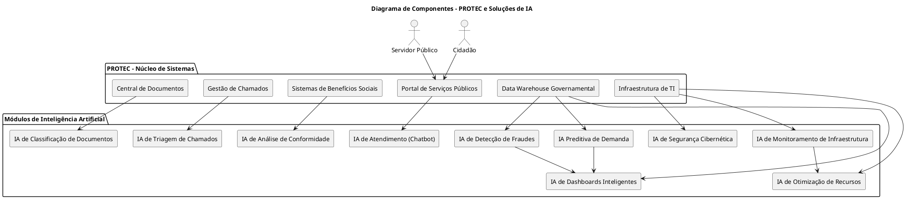

# 📘 Diagrama de Componentes - PROTEC (PlantUML)
A PROTEC deseja modernizar seus sistemas por meio de Inteligência Artificial, atuando em três principais frentes:
- Automação Inteligente de Processos
- Análise Preditiva e Apoio à Decisão
- Otimização de Infraestrutura e Segurança Cibernética

Este diagrama reflete essa estrutura modular e sua interação com sistemas legados e usuários.

# 🔧 PlantUML - Código

# 🔗 Referência
Você pode visualizar este código diretamente no site do PlantUML:
👉 https://plantuml.com/component-diagram

Se quiser, posso gerar a imagem para você. Deseja isso?